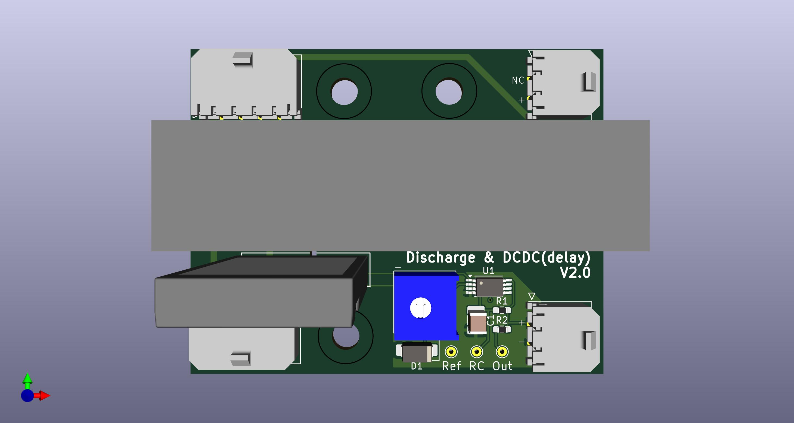
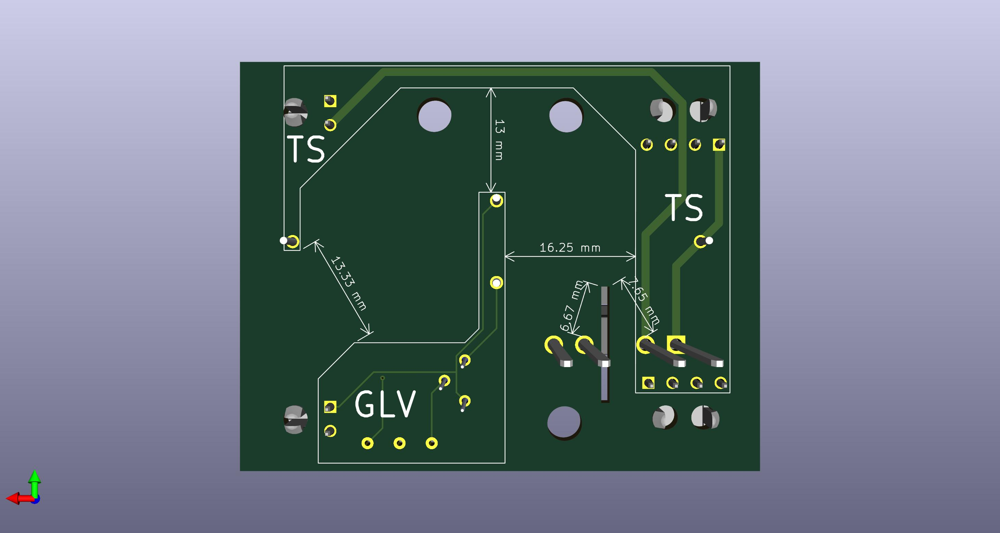

# VR7.5-Discharge-TimeDelayDCDC
A KiCad project for Discharge&amp;TimeDelayDCDC PCB

## Front

## Back

## Features
- [x] Schematic
  - [x] At least 5s Time Delay on DCDC output
  - [x] Flyback Diode beside coils
  - [x] ALL Spice Model
  - [x] Simulation Success
  - [x] Electrical Rules Check(ERC)
- [x] PCB
  - [x] Mounting Holes
  - [x] Test Points
  - [x] Wide Traces on HV
  - [x] Mark Distance between HV and LV
  - [x] Ground Plane
  - [x] Version Number
  - [x] Design Rules Check(DRC)
- [ ] Manufacturing
  - [x] Gerber Files
  - [x] Drill Files
  - [x] BOM
  - [ ] Pick and Place File
- [x] Assembly
  - [x] Soldering
  - [x] Testing
  - [x] Debugging
